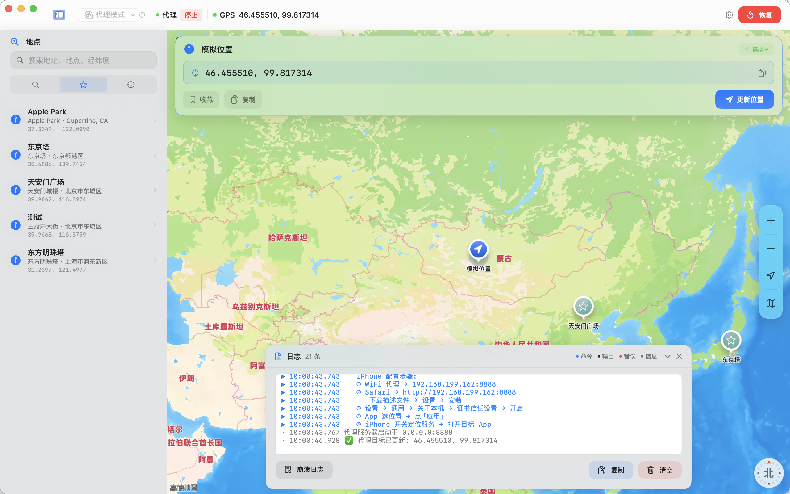

# VirtualLocation

macOS 上模拟 iOS 设备定位的工具，支持 **普通模式 (DVT)** 和 **代理模式 (MITM)** 两种方案。



## 构建

```bash
# 编译
swift build -c release

# 打包 .app
./build_app.sh arm     # Apple Silicon
./build_app.sh intel   # Intel
./build_app.sh u2b     # Universal
```

## 两种方案

### 1. 普通模式 (DVT)

通过 USB 利用 Apple 的 **DVT (Developer Tools)** 协议直接向 iOS 设备注入定位。

- 原理：Mac 通过 `usbmuxd` 与 iPhone 通信，调用 `pymobiledevice3` 的 `developer dvt simulate-location set` 命令，将坐标写入设备的 GPS 子系统。DVT 进程需保持运行以维持模拟定位。
- 优点：设置简单，即插即用。
- 缺点：必须插线，依赖 Python 环境。

**用法：**
1. 数据线连接 iPhone，确保已开启开发者模式
2. 点击工具栏安装 `pymobiledevice3`（自动创建 `~/.venv_pmd3/` 虚拟环境）
3. 选择设备，点击地图选点后按 `Cmd+Return` 应用

### 2. 代理模式 (MITM)

在 Mac 上启动 HTTP/HTTPS 代理，对 iPhone 的 WiFi 定位请求进行**中间人劫持**，篡改定位响应。

- 原理：iPhone 会向 `gs-loc.apple.com` / `gs-loc-cn.apple.com` 发起 WiFi 定位请求（protobuf 格式）。代理拦截该请求，完成 TLS 握手后解析 protobuf 载荷，找到其中的经纬度字段进行替换，再返回篡改后的响应给 iPhone。
- 细节：代理自动生成 CA 证书，并为 Apple 定位域名动态签发服务器证书；支持 gzip 压缩的 protobuf 响应解包与回包。
- 优点：无线操作，无需数据线。
- 缺点：需要配置 WiFi 代理并手动安装/信任 CA 证书。

**用法：**
1. iPhone 连接 Mac 同个 WiFi，**先关闭 iPhone 上的 VPN/代理软件**，再设置 WiFi 代理为 Mac IP + 指定端口（默认 8888）
2. 用 Safari 访问 `http://<Mac IP>:<端口>` 下载并安装 CA 证书
3. 在 iOS 设置 > 通用 > 关于 > 证书信任设置中**启用**该证书
4. 点启动代理，选点后按 `Cmd+Return` 应用

> 代理启动后会自动生成 CA 证书并导入 macOS 钥匙串。

> 代理模式的实现参考了 [proxypin-wloc-spoofer](https://github.com/FFF686868/proxypin-wloc-spoofer) —— 一个通过 ProxyPin 脚本劫持 Apple WLOC 定位响应的开源项目。

## 系统要求

- macOS 14+
- Xcode Command Line Tools
- 普通模式：USB 连接的 iOS 设备
- 代理模式：OpenSSL、同一 WiFi 下的 iPhone
