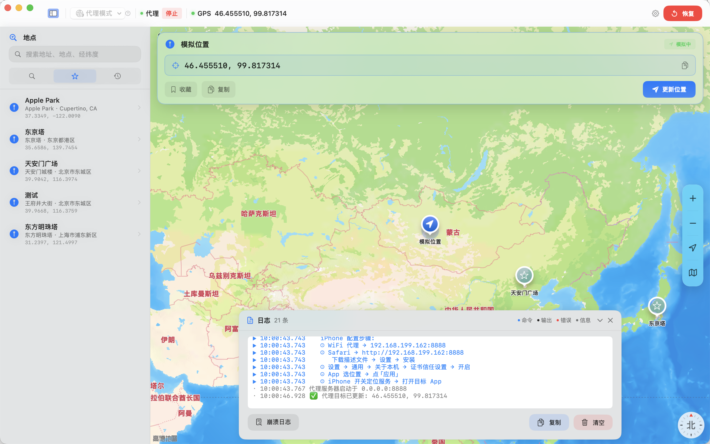

# VirtualLocation

macOS 上模拟 iOS 设备定位的工具，支持 **普通模式 (DVT)** 和 **代理模式 (MITM)** 两种方案。



## 构建

```bash
# 编译
swift build -c release

# 打包 .app
./build_app.sh arm     # Apple Silicon
./build_app.sh intel   # Intel
./build_app.sh u2b     # Universal

# 如遇到「Apple 无法验证 'VirtualLocation.app' 是否包含可能危害 Mac 安全或泄漏隐私的恶意软件」提示，请运行以下命令解除隔离标记：
xattr -cr /Applications/VirtualLocation.app
```

## 两种方案

### 1. 普通模式 (DVT)

通过 USB 利用 Apple 的 **DVT (Developer Tools)** 协议直接向 iOS 设备注入定位。

- 原理：Mac 通过 `usbmuxd` 与 iPhone 通信，调用 `pymobiledevice3` 的 `developer dvt simulate-location set` 命令，将坐标写入设备的 GPS 子系统。DVT 进程需保持运行以维持模拟定位。
- 优点：设置简单，即插即用。
- 缺点：必须插线，依赖 Python 环境。

**用法：**
1. 数据线连接 iPhone，确保已开启开发者模式
2. 点击工具栏安装 `pymobiledevice3`（自动创建 `~/.venv_pmd3/` 虚拟环境）
3. 选择设备，点击地图选点后按 `应用`

### 2. 代理模式 (MITM)

在 Mac 上启动 HTTP/HTTPS 代理，对 iPhone 的 WiFi 定位请求进行**中间人劫持**，篡改定位响应。

- 原理：iPhone 会向 `gs-loc.apple.com` / `gs-loc-cn.apple.com` 发起 WiFi 定位请求（protobuf 格式）。代理拦截该请求，完成 TLS 握手后解析 protobuf 载荷，找到其中的经纬度字段进行替换，再返回篡改后的响应给 iPhone。
- 细节：代理自动生成 CA 证书，并为 Apple 定位域名动态签发服务器证书；支持 gzip 压缩的 protobuf 响应解包与回包。
- 优点：无线操作，无需数据线。
- 缺点：需要配置 WiFi 代理并手动安装/信任 CA 证书。

**用法：**
1. iPhone 连接 Mac 同个 WiFi，**先关闭 iPhone 上的 VPN/代理软件**，再设置 WiFi 代理为 Mac IP + 指定端口（默认 8888）
2. 用 Safari 访问 `http://<Mac IP>:<端口>` 下载并安装 CA 证书
3. 在 iOS 设置 > 通用 > 关于 > 证书信任设置中**启用**该证书
4. 点启动代理，选点后按 `应用`
5. 关闭/重新打开 iOS 设备的定位服务

> 代理启动后会自动生成 CA 证书并导入 macOS 钥匙串。

> 代理模式的实现参考了 [proxypin-wloc-spoofer](https://github.com/FFF686868/proxypin-wloc-spoofer) —— 一个通过 ProxyPin 脚本劫持 Apple WLOC 定位响应的开源项目。

## 设置

按 `⌘,` 或点击工具栏右上角的齿轮图标打开（系统标准偏好设置窗口）。

- **通用**：切换定位模式、配置代理端口（1024–65535，代理运行时锁定）、查看本机代理地址与配置目录。
- **证书**：查看 CA 证书的名称 / 有效期 / 序列号 / SHA-256 指纹，并管理证书：
  - **CA 证书**：名称、有效期（到期前 30 天给出提醒）、序列号、SHA-256 指纹；右上角按钮可手动重新检测。
  - **信任状态**：iPhone 侧是否信任只能在设备上查看，Mac 读不到，所以这里只给安装步骤与「复制地址」，不伪装成状态。
  - **CA 证书包**：
    - **导出…** → 生成 `VirtualLocation-CA.p12`（**含 CA 私钥**，密码固定为 `vloc`）。
    - **导入…** → 选择另一台 Mac 导出的 `.p12` / `.pfx`，**替换本机 CA**。
    - 于是两台 Mac 共用同一套 CA，iPhone 只需要安装一次证书。代理运行中禁止导入。
  - **维护**：重新生成 CA（旧证书立即失效，所有设备都要重装）、打开证书目录。
- **关于**：版本信息与项目地址。

> 代理模式需要 **iPhone** 信任 CA 证书，这一步必须在设备端手动完成。macOS 钥匙串的信任与 iPhone 的信任相互独立，本应用不再代为写入系统钥匙串。
>
> `.p12` 里带的是 CA 私钥 —— 谁拿到它就能签发任意证书。只在你自己可控的设备之间传递。

### 多台 Mac 共用一套 CA

1. 在 Mac A：`设置 → 证书 → CA 证书包 → 导出…`，得到 `VirtualLocation-CA.p12`。
2. 在 Mac B：`设置 → 证书 → CA 证书包 → 导入…`，选中该文件。
3. 导入后 Mac B 的 CA 名称、序列号、指纹与 Mac A 完全一致，用它签出的服务器证书能被 Mac A 的证书链验证通过。

> 只把公钥（`ca-cert.pem`）拷到另一台 Mac 是**没用的**：CA 的**公钥无法签发**服务器证书，必须连同私钥一起传（即 `.p12`）。
> 另外注意：证书的**序列号**是 CA 自身的属性，导入前后必然相同；如果两台机器显示不同，说明导入没有真正替换本机 CA。

### 排查：iPhone 连不上、App 日志里一条请求都没有

如果 iPhone 打不开 `http://<Mac IP>:<端口>`、日志里也没有任何请求，说明**请求根本没到 Mac**，此时跟证书无关。检查：

1. iPhone 的 WiFi 代理地址/端口是否与「设置 → 通用 → 本机地址」完全一致（**最常见**）。
2. iPhone 与本机是否在同一个 WiFi，并关闭 iPhone 上的 VPN / 代理软件。

> 「证书」页的 iPhone 一栏不是状态，而是提示：Mac 无法读取设备的信任设置。
> 只有在观测到设备真实完成过 TLS 握手时，才会提示「该 CA 在设备上已受信任」。

## 系统要求

- macOS 14+
- Xcode Command Line Tools
- 普通模式：USB 连接的 iOS 设备
- 代理模式：OpenSSL、同一 WiFi 下的 iPhone
